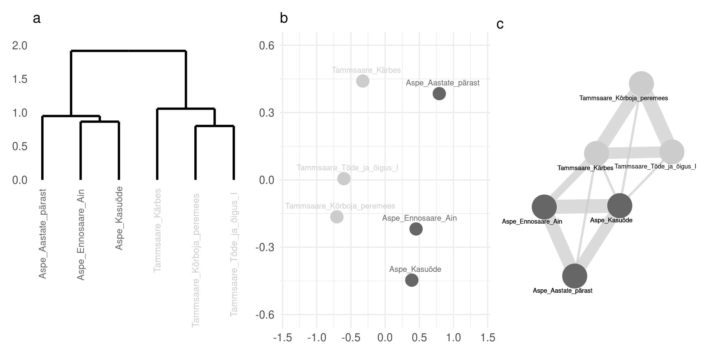

### Code & Data for 'Differences, distances and fingerprints: the fundamentals of stylometry and multivariate text analysis', Keel & Kirjandus 2021

#### Data

Small collection of early Estionian fiction comes from [**E-raamatute eeltöödeldud ja lemmatiseeritud failid**](https://datadoi.ee/handle/33/76), a dataset prepared by Kristel Uiboaed. I have balanced the collection by the number of texts per author (at least three, if author had more, I did choose 3 randomly). Originally the spelling was non-standardized and included old Estonian conventions: the only thing I did was replace "w" with "v". Further usage of this collection for computational analysis would need a proper standardization.

#### Workflow

`00_data_plots.R` contains all code for Figures 1-4 construction.  
`01_experimental_setup.R` runs main experiments, saves the results (data for Figures 5-6).  
`02_plots_final.R` uses previously saved results (`/data`) to produce final publication plots.  

